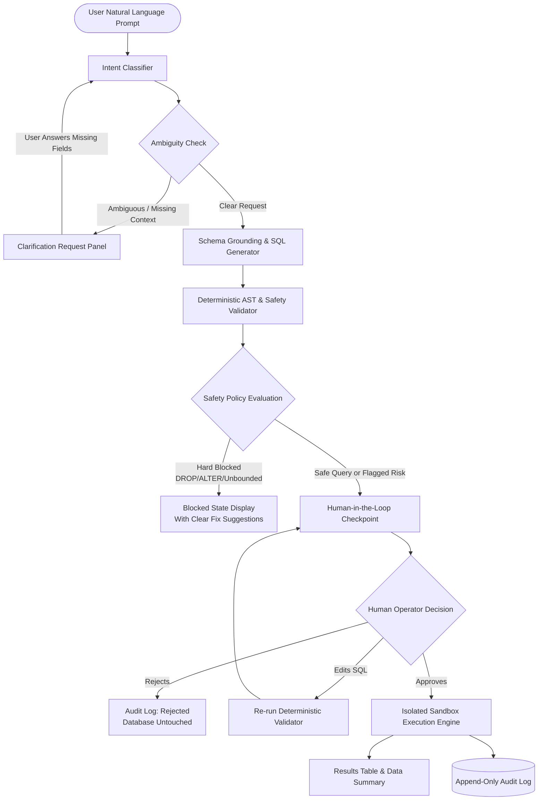

# 🛡️ Safe NL-to-SQL Assistant

> **Deterministic Safety, Human-in-the-Loop Governance, and Resilient Database Operations.**  
> *Transforming natural language into verified, auditable SQL without ever risking your database.*

[](https://fastapi.tiangolo.com)
[](https://github.com/langchain-ai/langgraph)
[](https://react.dev)
[](https://tailwindcss.com)
[](https://www.sqlite.org)
[](file:///Users/manashswain/Projects/Vid-AI-Assistant/backend/tests)

---

## 🌟 Why This is NOT Just Another SQL Writer

Most "Text-to-SQL" tools are vulnerable black boxes: you ask a question, an LLM outputs raw SQL, and it immediately runs on your live database. 

**This architecture is fundamentally different.** LLMs can hallucinate table names, generate destructive mutations, omit `WHERE` clauses, or fall prey to prompt injection. Relying solely on an LLM to decide what is "safe" is unacceptable for production systems.

```
❌ Traditional Text-to-SQL:
User Prompt ──────────▶ LLM ──────────▶ Unchecked Live Execution ──▶ 💥 Catastrophic Data Loss

✅ Our Guarded Architecture:
User Prompt ──▶ Intent/Ambiguity ──▶ SQL Gen ──▶ Deterministic AST Validator ──▶ Human Approval ──▶ Isolated Sandbox ──▶ Immutable Audit Trail
```

### Core Security Principles:
1. **Separation of LLM & Safety Verification:** The LLM *proposes* queries; independent deterministic AST parsers *validate* them against strict security rules and current database schemas.
2. **Human-in-the-Loop (HITL) Checkpoints:** Any query that modifies data or triggers safety warnings is paused in a persistent state machine. The human operator can inspect estimated row impacts, edit the SQL in an in-browser console, approve, or reject.
3. **Fail-Closed by Design:** If a query attempts to drop tables, alter schema, modify rows without filters, or access internal engine tables (`sqlite_*`), execution is strictly blocked before reaching the database.
4. **Complete Traceability:** Every request, generated statement, AST risk score, human intervention, and execution result is recorded into an append-only audit log.

---

## 🔄 Flow of Execution & System Architecture

The assistant is powered by a **LangGraph state machine** with persistent SQLite checkpointers (`checkpoints.db`).

### End-to-End Workflow



### Step-by-Step Lifecycle:
1. **Intent Classification:** Parses the user's inquiry into a structured taxonomy (`read_aggregation`, `read_filter`, `write_update`, `write_delete`, etc.).
2. **Ambiguity & Disambiguation:** Checks if the prompt is missing vital filters (e.g., date ranges, status filters) instead of guessing or hallucinating default values.
3. **Schema-Grounded Generation:** Injects the active schema into an optimized LLM system prompt (Groq Llama 3.3 70B / OpenRouter) producing clean ANSI SQL.
4. **Deterministic AST Validation:** Performs syntax parsing and inspects abstract syntax trees to guarantee:
   - Valid table and column identifiers.
   - Zero structural mutations (`DROP TABLE`, `ALTER TABLE`, `TRUNCATE`).
   - Mandatory `WHERE` clauses on any `UPDATE` or `DELETE` statement.
   - No unauthorized access to `sqlite_master` or internal functions.
5. **Stateful Checkpoint (`awaiting_approval`):** The LangGraph execution pauses and yields control back to the UI. The user sees:
   - Formatted syntax-highlighted SQL.
   - Estimated rows affected.
   - Exact safety analysis with clear badges.
6. **Execution in Sandbox:** Once approved (or immediately for safe, non-destructive SELECTs), the query runs inside a secured SQLite sandbox.
7. **Immutable Audit Logging:** Timestamps, latency, user prompt, finalized SQL, human decision (`approved`, `rejected`, `edited`), and status are written to SQLite audit storage.

---

## 🛡️ Deterministic Safety Guardrails Matrix

| Threat Category | Unsafe Example | How We Prevent It |
|---|---|---|
| **Catastrophic Schema Drops** | `DROP TABLE orders;` | **Hard Blocked:** AST rejects all DDL (`DROP`, `ALTER`, `CREATE`). |
| **Unbounded Bulk Deletes** | `DELETE FROM customers;` | **Blocked:** Mandatory `WHERE` clause check. Flags unrestricted operations. |
| **Unbounded Mass Updates** | `UPDATE products SET price = 0;` | **Blocked:** Requires explicit filtering conditions and human approval. |
| **System Table Snooping** | `SELECT * FROM sqlite_master;` | **Blocked:** Restricts access to internal metadata tables. |
| **Injection / Extension Loading** | `SELECT load_extension('...');` | **Blocked:** Function blacklist blocks dangerous I/O and dynamic library calls. |
| **LLM Ambiguity Hallucination** | *"Update customer status"* | **Clarification:** Prompts user for target customer ID before generating SQL. |

---

## 💻 Tech Stack

### Frontend
- **Framework:** [React 19](https://react.dev/) + [Vite](https://vitejs.dev/)
- **Language:** JavaScript (ESNext, strictly `.jsx` / `.js`)
- **Styling:** [Tailwind CSS](https://tailwindcss.com/) (Custom Dark Glassmorphic Theme with `#76C457` Green Accents)
- **Animations:** [Framer Motion](https://www.framer.com/motion/)
- **Icons:** [Lucide React](https://lucide.dev/)
- **HTTP Client:** [Axios](https://axios-http.com/)

### Backend
- **Framework:** [FastAPI](https://fastapi.tiangolo.com/) + [Uvicorn](https://www.uvicorn.org/)
- **Agent Orchestration:** [LangGraph](https://github.com/langchain-ai/langgraph) + [LangChain](https://www.langchain.com/)
- **LLM Engine:** [Groq](https://groq.com/) (`llama-3.3-70b-versatile`) or [OpenRouter](https://openrouter.ai/)
- **Database Sandbox:** [SQLite 3](https://www.sqlite.org/) with sample e-commerce datasets (Customers, Products, Orders, Order Items)
- **Validation Engine:** Deterministic AST analysis and Pydantic v2 data models
- **Testing:** [Pytest](https://docs.pytest.org/) (22 comprehensive unit and integration tests)

---

## 📂 Project Structure

```
Vid-AI-Assistant/
├── backend/
│   ├── agent/
│   │   ├── graph/
│   │   │   ├── nodes/
│   │   │   │   ├── ambiguity_checker.py   # Resolves under-specified requests
│   │   │   │   ├── executor.py            # Sandboxed SQLite runner
│   │   │   │   ├── human_approval.py      # HITL decision handler
│   │   │   │   ├── intent_parser.py       # Query taxonomy classifier
│   │   │   │   ├── sql_generator.py       # Schema-grounded LLM generator
│   │   │   │   └── validator.py           # AST safety parser & policy rules
│   │   │   ├── build_graph.py             # LangGraph state machine definition
│   │   │   ├── routes.py                  # State transition conditional logic
│   │   │   └── state.py                   # Agent workflow state definition
│   │   └── schemas/
│   │       └── pydantic_models.py         # Request and response models
│   ├── database/
│   │   ├── audit.py                       # Immutable audit log storage
│   │   ├── connection.py                  # Thread-safe SQLite connection factory
│   │   └── sandbox_seed.py                # Sandbox seeder with sample data
│   ├── tests/                             # Full automated test suite (Pytest)
│   ├── main.py                            # FastAPI server and endpoints
│   ├── requirements.txt                   # Backend dependencies
│   └── .env.example                       # Backend environment template
├── frontend/
│   ├── src/
│   │   ├── components/
│   │   │   ├── audit/                     # Audit trail inspector & clearing modal
│   │   │   ├── clarification/             # Interactive disambiguation UI
│   │   │   ├── database/                  # Live sandbox data & schema explorer
│   │   │   ├── history/                   # Session history & resume capability
│   │   │   ├── layout/                    # Responsive header & brand bar
│   │   │   ├── query/                     # Natural language query input & results
│   │   │   └── safety/                    # Risk badges, blocked alert card & impact
│   │   ├── lib/
│   │   │   ├── api.js                     # Configurable API client
│   │   │   └── utils.js                   # Formatters and color helpers
│   │   ├── pages/                         # QueryPage, DatabasePage, HistoryPage, AuditPage
│   │   ├── App.jsx                        # Single-scroll layout with view navigation
│   │   └── index.css                      # Tailwind styling & typography
│   ├── package.json
│   ├── vercel.json                        # Vercel SPA routing rewrite rules
│   └── .env.example                       # Frontend environment template
├── render.yaml                            # Render Infrastructure-as-Code Blueprint
└── README.md
```

---

## 🚀 Local Development Setup

### 1. Prerequisites
- Python 3.10+
- Node.js 18+ and npm
- A Groq API key ([console.groq.com](https://console.groq.com)) or OpenRouter API key

### 2. Backend Setup
```bash
# Clone the repository
git clone https://github.com/Manash2005/Vid-AI-Assistant.git
cd Vid-AI-Assistant

# Create and activate a virtual environment
python3 -m venv venv
source venv/bin/activate  # On Windows: venv\Scripts\activate

# Install backend dependencies
pip install -r backend/requirements.txt

# Configure environment variables
cp backend/.env.example backend/.env
# Edit backend/.env and insert your GROQ_API_KEY or OPENROUTER_API_KEY

# Start backend server
uvicorn backend.main:app --reload --port 8000
```
Backend will be live at `http://localhost:8000` (Swagger docs available at `http://localhost:8000/docs`).

### 3. Frontend Setup
In a new terminal window:
```bash
cd frontend

# Install dependencies
npm install

# Configure environment variables
cp .env.example .env
# Default VITE_API_BASE_URL is http://localhost:8000 (or leave empty to use Vite proxy)

# Start Vite dev server
npm run dev
```
Frontend will be running at `http://localhost:5173`.

### 4. Running Tests
```bash
# Run backend test suite (22 unit & integration tests)
PYTHONPATH=. pytest backend

# Verify frontend production build
cd frontend && npm run build
```

---

## 🌐 Production Deployment Guide

### Deploying the Backend on Render

1. Log in to [Render](https://dashboard.render.com/) and click **New +** > **Web Service**.
2. Connect your GitHub repository.
3. Configure the following service settings:
   - **Name:** `sql-assistant-backend`
   - **Region:** Choose the region nearest to you.
   - **Branch:** `main`
   - **Root Directory:** *(leave blank)*
   - **Runtime:** `Python 3`
   - **Build Command:**
     ```bash
     pip install -r backend/requirements.txt
     ```
   - **Start Command:**
     ```bash
     uvicorn backend.main:app --host 0.0.0.0 --port $PORT
     ```
4. Add the following **Environment Variables**:
   | Variable | Value | Description |
   |---|---|---|
   | `GROQ_API_KEY` | `gsk_...` | Your Groq API key |
   | `FRONTEND_URL` | `https://your-app.vercel.app` | URL of your deployed Vercel frontend |
   | `ALLOWED_ORIGINS` | `https://your-app.vercel.app` | Comma-separated allowed CORS origins |
   | `PYTHON_VERSION` | `3.11.9` | Recommended Python runtime |

*(Alternatively, use the included [`render.yaml`](file:///Users/manashswain/Projects/Vid-AI-Assistant/render.yaml) blueprint to automate this configuration).*

---

### Deploying the Frontend on Vercel

1. Log in to [Vercel](https://vercel.com/) and click **Add New...** > **Project**.
2. Import your GitHub repository.
3. In the configuration screen:
   - **Framework Preset:** `Vite`
   - **Root Directory:** Click Edit and select `frontend`.
   - **Build Command:** `npm run build`
   - **Output Directory:** `dist`
   - **Install Command:** `npm install`
4. Add the following **Environment Variable**:
   | Variable | Value | Description |
   |---|---|---|
   | `VITE_API_BASE_URL` | `https://sql-assistant-backend.onrender.com` | Your live Render backend URL (no trailing slash) |
5. Click **Deploy**. Vercel will build the frontend and serve it with automatic SPA routing using the included [`vercel.json`](file:///Users/manashswain/Projects/Vid-AI-Assistant/frontend/vercel.json).

---

## 🔌 API Endpoints Reference

| Endpoint | Method | Description |
|---|---|---|
| `/query` | `POST` | Submits a natural language query into the LangGraph state machine. |
| `/approve/{thread_id}` | `POST` | Resumes an `awaiting_approval` query and executes the SQL in sandbox. |
| `/reject/{thread_id}` | `POST` | Rejects the proposed SQL, preventing any database execution. |
| `/edit/{thread_id}` | `POST` | Submits modified SQL for re-validation before approval. |
| `/tables` | `GET` | Lists all active sandbox tables with row counts. |
| `/table/{name}` | `GET` | Fetches live rows and columns from a specific table. |
| `/schema` | `GET` | Returns full schema definitions and foreign key constraints. |
| `/audit` | `GET` | Returns immutable chronological audit logs. |
| `/audit/clear` | `DELETE` | Clears historical audit entries from the database. |
| `/health` | `GET` | Health check endpoint returning backend status. |

---

## 📄 License

Distributed under the MIT License. See `LICENSE` for more information.
